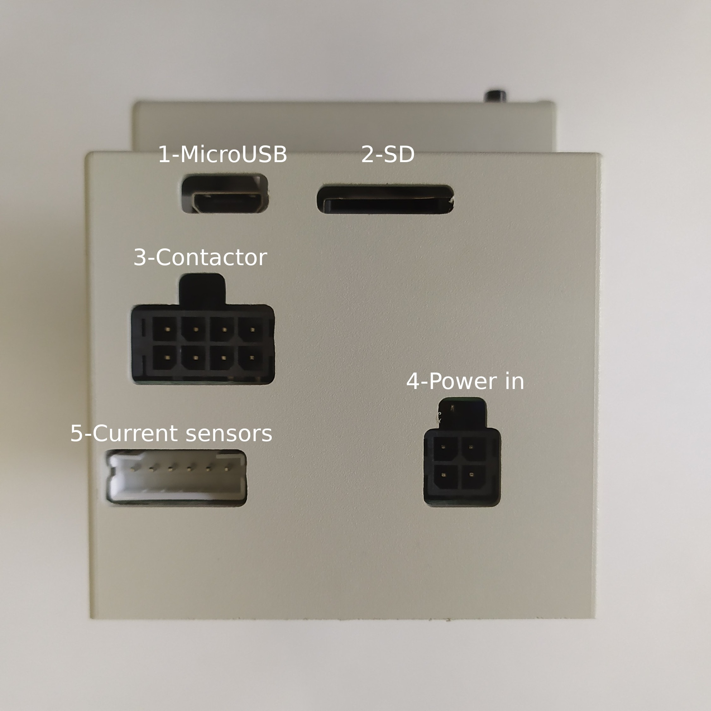
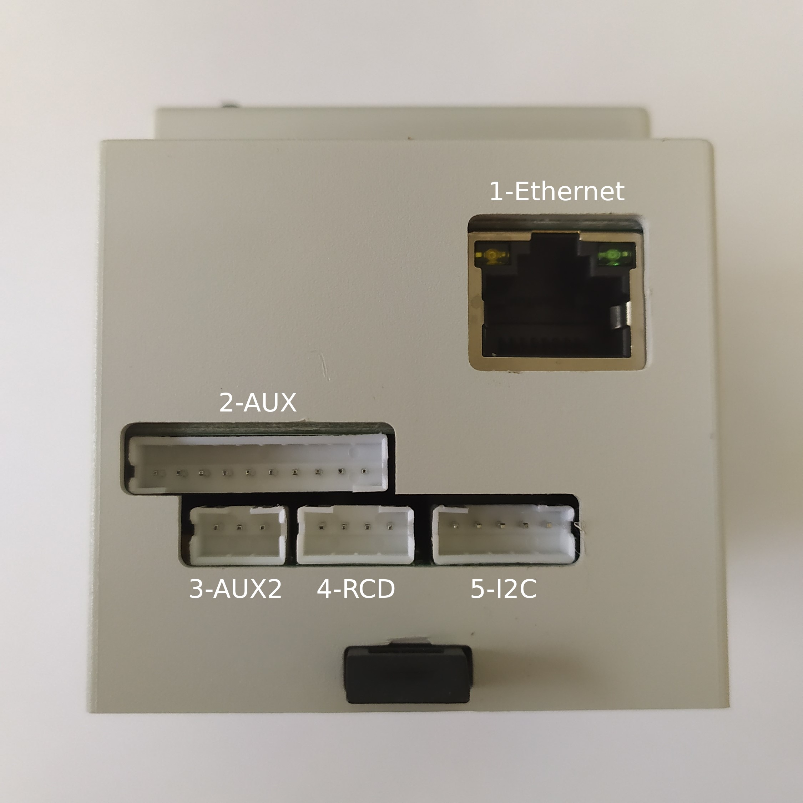
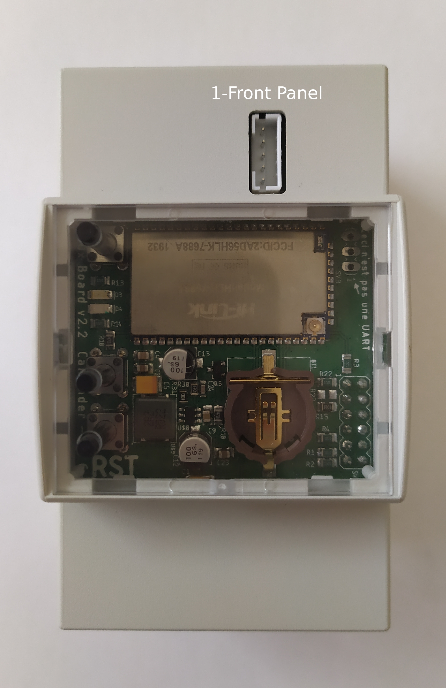
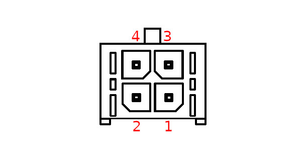
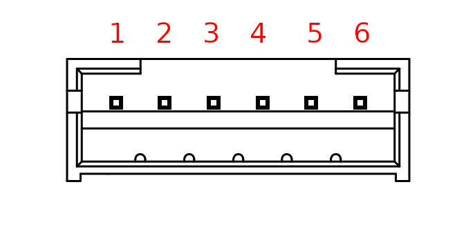
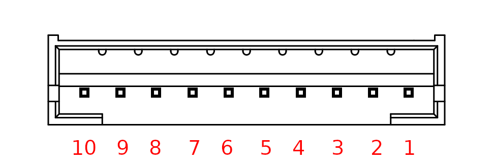

Pinout
======

Here you can find all the connectors pinout. 

.. note:: All the part number are for the female connectors!

Top view
--------

.. csv-table::
   :widths: 10, 20, 20
   
   **Number**, **Description**, **Part Number**
   1, `Micro USB`_,
   2, SD_,
   3, Contactor_, Wurt Elektronik - 662008113322
   4, `Power input`_, Wurt Elektronik - 662004113322
   5, `Current sensors`_, JST - PHR-6

Bottom view
-----------

.. csv-table::
   :widths: 10, 20, 20
   
   **Number**, **Description**, **Part Number**
   1, `Ethernet`_, 
   2, AUX_, JST - PHR-10
   3, AUX2_, JST - PHR-3
   4, `RCD`_, JST - PHR-4
   5, `I2C`_, JST - PHR-5

Front view
----------

.. csv-table::
   :widths: 10, 20, 20
   
   **Number**, **Description**, **Part Number**
   1, `Front Panel`_, JST - PHR-5

Connectors
----------

Micro USB
~~~~~~~~~
TODO little description

SD
~~
TODO little description

Contactor
~~~~~~~~~

.. figure:: _img/pinout/contactor_connector.jpg
    :align: center
    :height: 150px

.. csv-table::
   :widths: 10, 20, 20
   
   **Pin**, **Signal**, **Description**
   1,
   2,
   3,
   4,
   5,
   6,
   7,
   8,

Power input
~~~~~~~~~~~

.. csv-table::
   :widths: 10, 20, 20
   
   **Pin**, **Signal**, **Description**
   1,
   2,
   3,
   4,

Current sensors
~~~~~~~~~~~~~~~

.. csv-table::
   :widths: 10, 20, 20
   
   **Pin**, **Signal**, **Description**
   1,
   2,
   3,
   4,
   5,
   6,

Ethernet
~~~~~~~~
TODO little description

AUX
~~~

.. csv-table::
   :widths: 10, 20, 20
   
   **Pin**, **Signal**, **Description**
   1,
   2,
   3,
   4,
   5,
   6,
   7,
   8,
   9,
   10,

AUX2
~~~~
.. figure:: _img/pinout/aux2_connector.png
    :align: center
    :height: 150px

.. csv-table::
   :widths: 10, 20, 20
   
   **Pin**, **Signal**, **Description**
   1,
   2,
   3,

RCD
~~~
.. figure:: _img/pinout/rcd_connector.png
    :align: center
    :height: 150px

.. csv-table::
   :widths: 10, 20, 20
   
   **Pin**, **Signal**, **Description**
   1,
   2,
   3,
   4,

I2C
~~~
.. figure:: _img/pinout/5x1_connector.png
    :align: center
    :height: 150px

.. csv-table::
   :widths: 10, 20, 20
   
   **Pin**, **Signal**, **Description**
   1,
   2,
   3,
   4,
   5,

Front Panel
~~~~~~~~~~~
.. figure:: _img/pinout/5x1_connector.png
    :align: center
    :height: 150px

.. csv-table::
   :widths: 10, 20, 20
   
   **Pin**, **Signal**, **Description**
   1,
   2,
   3,
   4,
   5,
